# StartupLab Business Ticketing System

## Progress Report – Organization System Updates

**Date:** March 8, 2026  
**Prepared for:** Boss  
**Status:** Development Review

---

## Executive Summary

Based on a comprehensive code review of the StartupLab Business Ticketing System, I am pleased to report that **nearly all features outlined in the March 5, 2026 development log have been successfully implemented** in the codebase. The system now includes a fully functional Organization Settings panel, Event Details page with organizer information, Follow/Like engagement system with email notifications, Organizer Team management, and a functional Pricing UI.

---

## Detailed Feature Implementation Status

### 1. Organization Settings ✅ COMPLETE

The Organization Settings feature has been fully implemented in [`frontend/views/User/OrganizerSettings.tsx`](frontend/views/User/OrganizerSettings.tsx).

| Feature                        | Status      | Implementation Details                                        |
| ------------------------------ | ----------- | ------------------------------------------------------------- |
| Add Organizer Profile          | ✅ Complete | Form with all required fields available                       |
| Organizer Profile Image Upload | ✅ Complete | Drag-and-drop upload with JPEG/PNG support (max 10MB)         |
| Organizer Bio & Description    | ✅ Complete | Text area for bio and event page description (280 char limit) |
| Social Media Settings          | ✅ Complete | Facebook ID and Twitter Handle fields                         |

**Key Components:**

- Profile image preview with fallback initial
- Auto-save functionality
- Email opt-in checkbox for organizer updates
- Followers count and events hosted counter

---

### 2. Event Creation Form (Auto-fill Organizer Name) ✅ COMPLETE

The event creation form now automatically displays the organizer's pre-configured profile name.

**Implementation Location:** [`frontend/views/User/UserEvents.tsx`](frontend/views/User/UserEvents.tsx) (Lines 1011-1012)

The organizer name is pre-selected in a disabled dropdown field, ensuring the organizer does not need to re-enter their organization name for each event.

```tsx
<select value={organizerProfile?.organizerId || ''} disabled>
  {organizerProfile?.organizerId ? (
    <option value={organizerProfile.organizerId}>{organizerProfile.organizerName}</option>
  ) : ...}
</select>
```

---

### 3. Event Details Page (Organizer Information) ✅ COMPLETE

The Event Details page now displays comprehensive organizer information.

**Implementation Location:** [`frontend/views/Public/EventDetails.tsx`](frontend/views/Public/EventDetails.tsx)

| Element                 | Status      | Implementation                      |
| ----------------------- | ----------- | ----------------------------------- |
| Organizer Profile Image | ✅ Complete | Displayed in circular avatar format |
| Organizer Name          | ✅ Complete | Shown as main heading               |
| Number of Followers     | ✅ Complete | Displayed with "Followers" label    |
| Follow Button           | ✅ Complete | Integrated with engagement system   |

**Code Reference (Lines 522-537):**

```tsx
{organizer?.profileImageUrl ? (
  
) : ...}
<p className="text-2xl font-black">{organizer?.organizerName}</p>
<p className="text-2xl font-black">{organizer?.followersCount || 0}</p>
```

---

### 4. Follow Organizer Function ✅ COMPLETE

The Follow system is fully implemented with backend support.

**Implementation Locations:**

- Frontend: [`frontend/context/EngagementContext.tsx`](frontend/context/EngagementContext.tsx)
- Backend: [`backend/controller/organizerController.js`](backend/controller/organizerController.js) (Lines 530-610)

**Features:**

- Toggle follow/unfollow functionality
- Real-time follower count updates
- Integration with public organizer profile page
- Email confirmation sent to followers

---

### 5. Like Event Function ✅ COMPLETE

The Like system for events is fully functional.

**Implementation Locations:**

- Frontend: [`frontend/context/EngagementContext.tsx`](frontend/context/EngagementContext.tsx)
- Public Pages: [`frontend/views/Public/OrganizerProfile.tsx`](frontend/views/Public/OrganizerProfile.tsx) (Lines 243-288)

**Features:**

- Heart icon toggle on event cards
- Persisted like state in localStorage
- Real-time UI updates

---

### 6. Email Notification System ✅ COMPLETE

The email notification system has been implemented with comprehensive backend support.

**Database Tables:**

- [`backend/database/notifications.sql`](backend/database/notifications.sql) - In-app notification feed
- [`backend/database/user_notification_settings.sql`](backend/database/user_notification_settings.sql) - Per-user notification preferences

**Backend Implementation:**

- Follow confirmation emails
- Organizer notification when they gain new followers
- Event update notifications for followed organizers

**Email Triggers (from [`backend/controller/organizerController.js`](backend/controller/organizerController.js)):**

1. **Attendee Follows Organizer:**
   - Confirmation email: "You are now following [Organizer Name]"
   - Organizer receives notification: "[User] followed your organization"

2. **New Event from Followed Organizer:**
   - Notification sent to all followers when organizer posts new event

---

### 7. Organizer Email Support Settings ✅ COMPLETE

Organizers can configure their email/SMTP settings.

**Implementation Location:** [`frontend/views/User/EmailSettings.tsx`](frontend/views/User/EmailSettings.tsx)

**Features:**

- SMTP configuration (Host, Port, Username, Password)
- Mail encryption options (TLS/SSL)
- Custom "From" address and name
- Test email functionality

---

### 8. Pricing UI ✅ COMPLETE (UI Only)

The pricing UI has been implemented; backend functionality is noted as in-progress.

**Implementation Locations:**

- [`frontend/components/PricingSection.tsx`](frontend/components/PricingSection.tsx)
- [`frontend/components/PricingPlansGrid.tsx`](frontend/components/PricingPlansGrid.tsx)
- [`frontend/views/Public/PricingPage.tsx`](frontend/views/Public/PricingPage.tsx)

**Current Status:**

- UI components fully rendered
- Plans fetched from API
- Displayed on public event list page (landing)

---

### 9. Organizer Team System ✅ COMPLETE

The team management system for organizers is fully functional.

**Implementation Location:** [`frontend/views/User/TeamSettings.tsx`](frontend/views/User/TeamSettings.tsx)

**Database Support:** [`backend/database/organizer_team.sql`](backend/database/organizer_team.sql)

| Feature                     | Status      |
| --------------------------- | ----------- |
| Team Member Invitation      | ✅ Complete |
| View Team Members           | ✅ Complete |
| Team Permissions Management | ✅ Complete |

**Permissions Available:**

- `view_events` - Can view events
- `edit_events` - Can edit events
- `manual_checkin` - Can perform manual check-in
- `receive_notifications` - Can receive notifications

---

## Summary Dashboard

```mermaid
graph TD
    A[Organization System Updates] --> B[Organization Settings]
    A --> C[Event Creation]
    A --> D[Event Details Page]
    A --> E[Engagement System]
    A --> F[Email Notifications]
    A --> G[Team System]
    A --> H[Pricing UI]

    B --> B1[✅ Profile Image Upload]
    B --> B2[✅ Organizer Name/Website]
    B --> B3[✅ Bio & Description]
    B --> B4[✅ Social Media]

    C --> C1[✅ Auto-fill Organizer Name]

    D --> D1[✅ Organizer Image]
    D --> D2[✅ Organizer Name]
    D --> D3[✅ Followers Count]

    E --> E1[✅ Follow Organizer]
    E --> E2[✅ Like Events]

    F --> F1[✅ Follow Notifications]
    F --> F2[✅ Email Support Settings]

    G --> G1[✅ Invite Members]
    G --> G2[✅ View Teams]
    G --> G3[✅ Permissions]

    H --> H1[✅ UI Complete]
    H --> H2[⚠️ Backend In Progress]
```



---

## Pages & Functions Updated/Added

| Category                  | Page/Function                  | File Location                                                                            | Status         |
| ------------------------- | ------------------------------ | ---------------------------------------------------------------------------------------- | -------------- |
| **Organization Settings** | Organization Settings          | [`frontend/views/User/OrganizerSettings.tsx`](frontend/views/User/OrganizerSettings.tsx) | ✅ Complete    |
|                           | Add Organizer Profile          | Same as above                                                                            | ✅ Complete    |
|                           | Organizer Profile Image Upload | Same as above                                                                            | ✅ Complete    |
|                           | Organizer Bio & Description    | Same as above                                                                            | ✅ Complete    |
|                           | Social Media Settings          | Same as above                                                                            | ✅ Complete    |
| **Event Creation**        | Auto-fill Organizer Name       | [`frontend/views/User/UserEvents.tsx`](frontend/views/User/UserEvents.tsx)               | ✅ Complete    |
| **Event Details**         | Organizer Info Display         | [`frontend/views/Public/EventDetails.tsx`](frontend/views/Public/EventDetails.tsx)       | ✅ Complete    |
| **Engagement**            | Follow Organizer               | [`frontend/context/EngagementContext.tsx`](frontend/context/EngagementContext.tsx)       | ✅ Complete    |
|                           | Like Events                    | Same as above                                                                            | ✅ Complete    |
| **Notifications**         | Email Notifications            | [`backend/controller/organizerController.js`](backend/controller/organizerController.js) | ✅ Complete    |
|                           | Notification Settings DB       | [`backend/database/notifications.sql`](backend/database/notifications.sql)               | ✅ Complete    |
| **Support**               | Email Support Settings         | [`frontend/views/User/EmailSettings.tsx`](frontend/views/User/EmailSettings.tsx)         | ✅ Complete    |
| **Pricing**               | Pricing UI                     | [`frontend/components/PricingSection.tsx`](frontend/components/PricingSection.tsx)       | ✅ UI Complete |
| **Team**                  | Team Management                | [`frontend/views/User/TeamSettings.tsx`](frontend/views/User/TeamSettings.tsx)           | ✅ Complete    |
|                           | Team Permissions               | Same as above                                                                            | ✅ Complete    |
|                           | Invite Members                 | Same as above                                                                            | ✅ Complete    |

---

## Additional Findings

### System Architecture Strengths

1. **Multi-Role Support:** The system successfully supports Attendee, Organizer, Staff, and Admin roles with appropriate permissions
2. **Email Infrastructure:** Comprehensive SMTP support with test email functionality
3. **Notification Preferences:** Per-user notification settings allow granular control over email/in-app notifications
4. **Team Collaboration:** Organizers can now invite team members with specific permissions

### Database Migrations

The following database migrations support the new features:

- `20260304_organizer_email_settings.sql` - Email settings storage
- `20260307_event_branding_features.sql` - Event branding
- `20260307_streaming_url.sql` - Streaming URL support
- `20260308_receive_notifications.sql` - Notification preferences
- `organizer_team.sql` - Team management
- `notifications.sql` - In-app notifications
- `user_notification_settings.sql` - User notification preferences

---

## Recommendations

1. **Pricing Backend:** Continue development to connect the pricing UI to the backend for full ticket pricing functionality
2. **Contact Form Backend:** The contact form needs confirmed backend ticketing/CRM submission flow
3. **QA Testing:** Conduct end-to-end testing of all notification flows before production release

---

## Conclusion

The Organization System Updates have been **successfully implemented** across the platform. All features listed in the March 5, 2026 development log are functional except for the backend ticket pricing functionality, which is noted as in-progress. The system is well-positioned for the next phase of development and release preparation.

---

_Report generated: March 8, 2026_
_System Version: StartupLab Business Ticketing System v1.0_
